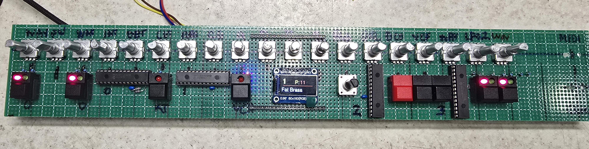

A MIDI controller for the Korg Poly-61 synth equipped with a Tauntek motherboard upgrade, all 24 controls are presented with buttons and LEDs for the switch functions. Encoders for the 0-99 controls. Encoders give a more accurate edit of the current parameter and can be accelerated to transition quickly of slowly across the range.

It will have 999 patch memories and names and can be used as a master for the Poly 61 which means you don't store any sounds on the 61 and the editor is in charge. Or normal mode where it just edits parameters.

This version uses MCP23017 chips to read the encoders and buttons and also to drive the LED's. This reduces chip count, analogue mux jitter etc.

The editor is ESP32 DEV module powered so it is very inexpensive to build.

Aftertouch is now translated to the Modulation Wheel, this can be turned off or on the settings menu.

Notes and CC messages that are not used by the editor are passed through to the 61.
